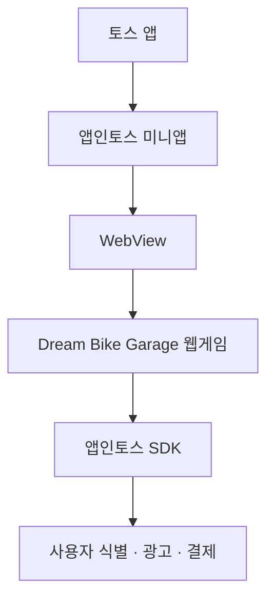

# 앱인토스 WebView 안내 및 적용 방안

> 대상 프로젝트: **Dream Bike Garage (오늘부터 자전거 부자)**  
> 문서 목적: 웹 MVP를 앱인토스(Apps in Toss)에서 출시하기 위한 공통 이해와 개발 기준을 정리한다.  
> 최종 업데이트: 2026-07-31

## 1. 결론

Dream Bike Garage는 **Vite + TypeScript + Phaser 기반 웹게임을 유지하고, 앱인토스 WebView SDK를 연결하는 방식**을 우선 채택한다.

이 방식은 현재 머지 코어와 UI를 대부분 재사용하면서 토스 앱 안에서 설치 없이 실행할 수 있다. GitHub Pages는 개발 확인과 웹 체험판 용도로 유지하고, 앱인토스에는 SDK를 적용한 별도 빌드 결과물을 등록한다.

## 2. 앱인토스란?

앱인토스는 외부 서비스나 게임을 토스 앱 안에서 실행할 수 있게 해주는 미니앱 플랫폼이다. 파트너는 앱인토스 SDK를 연동한 빌드 결과물을 콘솔에 업로드하고 검수를 거쳐 출시한다.

Dream Bike Garage 관점의 역할은 다음과 같다.

- 별도 앱 설치 없이 토스 안에서 게임 실행
- 기존 웹게임 소스 재사용
- 토스가 제공하는 사용자 식별, 광고, 결제, 프로모션 등의 기능을 SDK로 연결
- 앱인토스 콘솔에서 앱 정보, 빌드, 검수 및 출시 관리

## 3. WebView란?

WebView는 **모바일 앱 내부에서 웹 콘텐츠를 실행하는 브라우저 영역**이다. 사용자는 토스 앱 안에서 게임을 이용하지만, 게임 화면과 로직은 HTML, CSS, JavaScript로 동작한다.



일반 브라우저와 달리 주소창이 없고 앱 화면처럼 보인다. 토스 기능은 웹 코드에서 직접 사용하는 것이 아니라 앱인토스 SDK를 통하여 호출한다.

## 4. 현재 프로젝트에 적합한 이유

- 2D UI 중심의 캐주얼 머지게임이므로 WebView에서 구현하기 적합하다.
- 기존 Vite, TypeScript, Phaser 코드와 게임 데이터를 재사용할 수 있다.
- 주문 → 부품 생성 → 머지 → 조립 → 납품 → 급여 획득의 짧은 플레이 루프가 미니앱 이용 방식과 잘 맞는다.
- GitHub Pages와 앱인토스 버전이 동일한 게임 코어를 공유할 수 있다.
- 향후 Google Play 독립 앱을 준비하더라도 웹 코어와 플랫폼 연결 계층을 분리해 재사용할 수 있다.

## 5. 적용 구조

```text
src/
├─ core/                 # 머지, 주문, 조립, 보상 규칙
├─ game/                 # Phaser 화면과 입력 처리
├─ data/                 # 부품, 자전거, 주문 데이터
├─ platform/
│  ├─ web/               # 브라우저·GitHub Pages 구현
│  └─ apps-in-toss/      # 앱인토스 SDK 어댑터
└─ storage/
   ├─ local/             # 개발·웹 체험판 저장
   └─ remote/            # 출시용 서버 저장
```

게임 로직에서 SDK를 직접 호출하지 않고 플랫폼 인터페이스를 둔다.

```ts
interface GamePlatform {
  getUserId(): Promise<string | null>
  saveProgress(data: GameProgress): Promise<void>
  loadProgress(): Promise<GameProgress | null>
  showRewardedAd(): Promise<boolean>
  purchase(productId: string): Promise<PurchaseResult>
  haptic(type: "light" | "success"): Promise<void>
}
```

웹에서는 빈 구현 또는 테스트 구현을 사용하고, 앱인토스 빌드에서만 실제 SDK 어댑터를 주입한다. 광고나 결제를 붙이지 않은 첫 출시에서도 이 구조를 먼저 만들어 두는 것이 좋다.

## 6. 개발 및 출시 절차

### 1단계 — 웹 MVP 완성

- 주문별 필요 부품 표시
- 부품 생성과 동일 부품 2-to-1 머지
- 부품을 이용한 자전거 조립
- 제한 시간, 주문 성공·실패, 급여 보상
- 새로고침 후 진행 상태 복원
- 모바일 터치 입력 안정화

### 2단계 — 모바일 WebView 대응

- 세로 화면을 기본으로 설계
- `safe-area-inset-top/bottom`을 반영해 노치와 홈바 영역 보호
- 마우스 이벤트보다 Pointer Event 또는 터치 입력 우선 사용
- 브라우저 기본 스크롤, 확대, 길게 누르기 동작이 게임 조작과 충돌하지 않도록 처리
- 토스의 뒤로 가기와 게임 내 닫기·일시정지 정책 정의
- 백그라운드 전환, 종료 직전, 주문 상태 변경 시 자동 저장
- 저사양 기기에서 프레임, 메모리, 발열 확인

### 3단계 — 앱인토스 SDK 연동

- 앱인토스 개발자 콘솔에서 워크스페이스와 게임 등록
- 기존 웹 프로젝트용 WebView 개발 가이드에 따라 SDK 구성
- `granite.config.ts`의 앱 이름, 표시 이름, 아이콘을 콘솔 정보와 일치
- 로컬 및 샌드박스 환경에서 실행 확인
- 앱인토스 기능은 플랫폼 어댑터를 통하여 연결

> 패키지명과 SDK API는 변경될 수 있으므로 구현 시점의 공식 가이드를 기준으로 설치한다.

### 4단계 — 사용자 식별과 저장

초기 개발은 `localStorage`로 가능하지만 정식 서비스 데이터의 유일한 저장소로 사용하지 않는다.

서버 저장 대상:

- 보유 재화와 급여
- 드림 바이크 성장 상태
- 진행 중인 주문과 완료 기록
- 부품 및 자전거 컬렉션
- 광고 보상 수령 기록
- 구매 상품과 지급 이력

사용자 식별키는 로그인 화면을 만들지 않고 사용자를 구분하는 용도로 활용할 수 있다. 서버는 클라이언트가 보낸 재화·보상 결과를 그대로 신뢰하지 않고 검증해야 한다.

### 5단계 — 검수 준비와 출시

- 아이콘, 대표 이미지, 게임 설명 및 이용 방법 준비
- 이용약관, 개인정보처리방침, 고객 문의 방법 연결
- 로딩, 네트워크 오류, 점검, 서버 장애 화면 준비
- 사운드·효과음·진동의 켜기/끄기 제공
- 게임 출시 체크리스트에 따라 실제 기기 점검
- 앱인토스용 빌드 결과물을 콘솔에 업로드
- 앱 정보 및 빌드 검수 요청
- 승인 후 콘솔에서 출시

## 7. 플랫폼별 빌드 운영

| 구분 | GitHub Pages | 앱인토스 |
|---|---|---|
| 목적 | 개발 확인, 웹 체험판 | 모바일 정식 출시 |
| 실행 환경 | 일반 브라우저 | 토스 앱 내부 WebView |
| 빌드 | 기본 Vite 빌드 | 앱인토스 SDK 적용 빌드 |
| 사용자 식별 | 게스트 또는 개발용 | 앱인토스 사용자 식별키 |
| 저장 | localStorage 중심 | 서버 저장 중심 |
| 광고·결제 | 사용하지 않음 | 검수 후 단계적 적용 |
| 배포 | main 머지 후 Actions | 콘솔 업로드·검수·출시 |

환경별 코드를 복사하지 말고 환경 변수와 플랫폼 어댑터로 구분한다.

## 8. 첫 출시 범위

첫 출시의 목표는 **게임의 재미와 플레이 지속 여부 검증**이다.

포함:

- 핵심 주문형 머지 플레이
- 드림 바이크 1대의 성장
- 기본 컬렉션
- 사용자 식별과 서버 저장
- 튜토리얼, 설정, 오류 안내
- 플레이 이벤트 수집

제외 또는 후속 검토:

- 강제 전면 광고
- 인앱 결제
- 토스 포인트 프로모션
- 실제 글로벌 브랜드와 로고
- 대리점 쿠폰, 시승 예약 및 O2O
- 매치3, 레이스, 복잡한 경영 시스템

보상형 광고는 첫 출시가 안정된 뒤 **사용자가 선택하는 보상**으로 검토한다. 예: 부품 상자, 주문 시간 보완, 추가 생성 기회.

## 9. 측정할 지표

- 게임 실행 및 로딩 완료율
- 튜토리얼 완료율
- 첫 주문 완료율
- 주문 성공·실패 비율
- 세션당 주문 수
- 세션 길이
- 1일·7일 재방문율
- 머지 단계별 이탈 지점
- 오류율과 강제 종료율

이벤트 이름과 속성은 개발 전에 문서화하고, 개인정보를 이벤트 값에 포함하지 않는다.

## 10. 보안과 운영 주의사항

- 게임 재화, 보상, 구매 결과는 서버에서 검증한다.
- 사용자 식별키와 서버 비밀키를 클라이언트 저장소에 노출하지 않는다.
- 결제·광고·프로모션은 각각의 최신 검수 및 운영 정책을 확인한다.
- WebView에서 외부 링크를 열 때 허용 도메인과 이동 방식을 제한한다.
- 네트워크 재시도 때문에 보상이 중복 지급되지 않도록 요청 식별자와 멱등 처리를 사용한다.
- 데이터 초기화, 문의, 장애 공지와 서비스 종료 절차를 마련한다.

## 11. 기존 브랜드 기획서 활용 기준

첨부된 「글로벌 자전거 브랜드 게임 마케팅 기획서」에는 브랜드 컬렉션, 매치3, 레이스, O2O, 과금 모델이 제안되어 있다. 이는 현재 MVP의 필수 범위가 아니라 **향후 확장 아이디어**로 관리한다.

특히 실제 브랜드명, 모델명, 로고, 팀 에디션을 서비스에 노출하려면 라이선스와 상표권 검토가 선행되어야 한다. 첫 출시에서는 가상 브랜드와 자체 디자인을 사용한다.

현재 우선순위는 다음과 같다.

1. 주문형 머지 코어의 재미
2. 모바일 터치와 한 화면 UI
3. 안정적인 저장 및 복구
4. 앱인토스 검수 통과
5. 사용자 데이터 기반의 기능 확장

## 12. 출시 전 체크리스트

### 게임

- [ ] 주문 → 생성 → 머지 → 조립 → 납품 → 급여 루프가 끝까지 동작한다.
- [ ] 보드가 가득 찬 경우와 제한 시간 종료가 처리된다.
- [ ] 터치가 스크롤이나 확대 동작과 충돌하지 않는다.
- [ ] 작은 화면에서도 아이템과 주문 조건을 식별할 수 있다.
- [ ] 백그라운드 전환과 재실행 후 진행 상태가 복원된다.

### 앱인토스

- [ ] 콘솔 정보와 앱 설정이 일치한다.
- [ ] 샌드박스 및 실제 기기에서 테스트했다.
- [ ] 뒤로 가기, 닫기, 로딩, 오류, 점검 화면이 동작한다.
- [ ] 사용자 식별과 서버 저장을 검증했다.
- [ ] 게임 출시 가이드와 공통 정책을 확인했다.
- [ ] 아이콘, 설명, 약관, 개인정보처리방침, 문의 경로를 준비했다.
- [ ] 승인된 빌드만 출시한다.

## 13. 공식 참고 자료

- [앱인토스 소개](https://developers-apps-in-toss.toss.im/intro/overview.html)
- [기존 웹 프로젝트에 SDK 연동하기](https://developers-apps-in-toss.toss.im/ai-vibe-coding/tutorials/webview)
- [게임 출시 가이드](https://developers-apps-in-toss.toss.im/checklist/app-game)
- [서비스 오픈 프로세스](https://developers-apps-in-toss.toss.im/intro/onboarding-process.html)
- [미니앱 출시하기](https://developers-apps-in-toss.toss.im/guide/operation/deploy)
- [사용자 식별키 발급](https://developers-apps-in-toss.toss.im/user-hash-key/develop.html)
- [서비스별 주의사항](https://developers-apps-in-toss.toss.im/intro/caution)

정책과 SDK는 변경될 수 있으므로 개발 착수와 검수 요청 시점에 공식 문서를 다시 확인한다.
