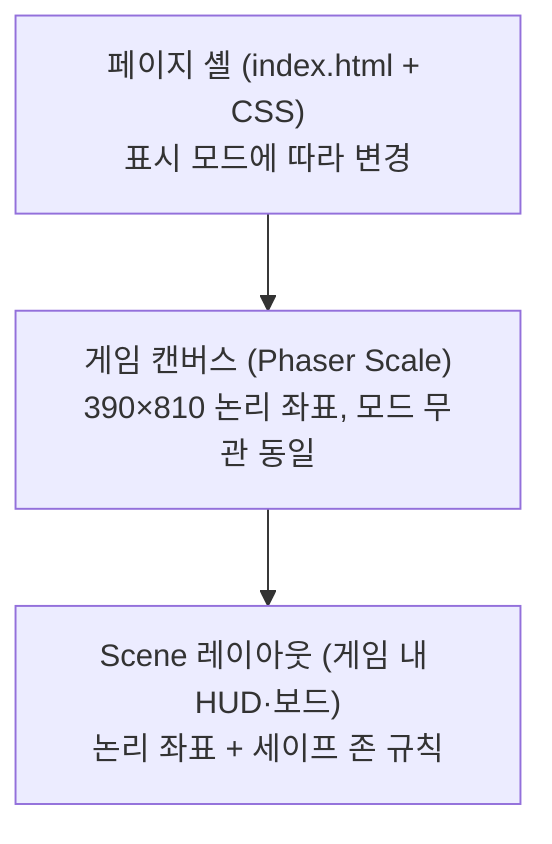

# 웹·앱 화면 구조 전략

> 대상 프로젝트: **Dream Bike Garage (오늘부터 자전거 부자)**
> 문서 목적: GitHub Pages(웹)에서 개발·확인하는 현재 방식과 앱인토스(Apps in Toss) WebView에서 앱처럼 보여야 하는 출시 방식을 하나의 화면 구조로 관리하기 위한 기준을 정리한다. Lab에서 프로토타입 트랙을 개발할 때도 이 문서를 공통 화면 규격으로 사용한다.
> 최종 업데이트: 2026-08-25

## 1. 결론 요약

- 게임 캔버스는 **세로 고정, 기준 해상도 390×810**을 유지한다.
- 화면 셸(캔버스를 감싸는 페이지 영역)은 **표시 모드 2가지**로 분리한다.
  - **웹 쇼케이스 모드**: 지금처럼 헤더와 액자형 프레임 안에서 게임을 보여준다. GitHub Pages 기본값.
  - **앱 풀스크린 모드**: 헤더·액자 없이 캔버스가 뷰포트 전체를 채운다. 앱인토스 빌드 기본값.
- 두 모드는 **게임 코드(Phaser Scene, domain)를 전혀 바꾸지 않고**, `index.html`/CSS 셸과 진입 설정만 다르게 한다.
- 웹에서도 `?mode=app` 쿼리로 앱 풀스크린 모드를 미리 확인할 수 있게 한다. 출시 전 화면 검증은 이 모드를 기준으로 한다.
- 기기 비율 대응(레터박스 vs 확장형)과 Safe Area 실기기 검증은 Lab 트랙에서 비교·검증하고, 채택안을 메인에 재구현한다.

## 2. 현재 구조 진단

현재 코드(2026-08 기준)는 다음과 같이 구성되어 있다.

| 구성 | 위치 | 현재 상태 |
|---|---|---|
| 페이지 셸 | `index.html` | 제목·설명이 있는 `header.game-header` + `#game-container` 섹션 |
| 셸 스타일 | `src/ui/styles.css` | `#game-container`에 테두리, 둥근 모서리, 그림자를 준 **액자형 레이아웃**. `aspect-ratio: 390/810`과 `100dvh` 계산으로 크기 결정 |
| 캔버스 설정 | `src/game/config.ts` | `width: 390, height: 810`, `Phaser.Scale.FIT` + `CENTER_BOTH` |
| Scene 좌표 | `src/game/scenes/MergeBoardScene.ts` | 390×810 논리 좌표에 고정 상수(`BOARD_X`, `BOARD_Y` 등)로 배치 |

이 구조는 데스크톱 브라우저에서 게임을 소개하고 확인하기에는 적합하지만, 그대로 앱인토스 WebView에 올리면 다음 문제가 생긴다.

1. **웹 헤더와 액자가 그대로 노출**되어 앱이 아니라 웹페이지처럼 보인다.
2. 기기 비율이 390:810(약 1:2.08)과 다르면 `FIT` 특성상 **상하 또는 좌우 여백(레터박스)**이 생긴다.
3. 노치·펀치홀·홈 인디케이터 영역(Safe Area)을 고려하지 않아 **상단 HUD나 하단 버튼이 시스템 UI에 가려질 수 있다**.
4. `viewport` 메타에 `viewport-fit=cover`가 없어 CSS `env(safe-area-inset-*)` 값을 읽을 수 없다.

## 3. 화면 레이어 정의

화면을 세 레이어로 나누어 책임을 분리한다. 표시 모드에 따라 달라지는 것은 **페이지 셸뿐**이다.

| 레이어 | 책임 | 표시 모드 영향 |
|---|---|---|
| 페이지 셸 | 캔버스를 어디에 어떤 크기로 앉힐지, 배경, 헤더 유무, Safe Area 패딩 | **받음** |
| 게임 캔버스 | 논리 좌표(390×810)와 실제 픽셀 간 스케일 변환 | 없음 |
| Scene 레이아웃 | HUD·보드·버튼의 논리 좌표 배치, 캔버스 내 세이프 존 준수 | 없음 |

## 4. 표시 모드

### 4.1 웹 쇼케이스 모드 (기본값: GitHub Pages)

- 목적: 개발 확인, 웹 체험판, 데스크톱에서의 소개 화면.
- 구성: 현재 구조 유지 — 페이지 헤더 + 액자형 `#game-container`.
- 유지 이유: 데스크톱 와이드 화면에서 캔버스만 덩그러니 확대되는 것보다 액자형이 보기 좋고, 지금까지의 확인 흐름을 깨지 않는다.

### 4.2 앱 풀스크린 모드 (기본값: 앱인토스 빌드)

- 목적: 앱인토스 WebView 및 모바일 실기기에서 **앱 화면처럼** 보이게 한다.
- 구성 규칙:
  - 페이지 헤더, 테두리, 둥근 모서리, 그림자를 모두 제거한다. 게임 제목 등은 이미 Scene 안에 그리고 있으므로 중복 노출하지 않는다.
  - `#game-container`가 뷰포트 전체(`100dvw × 100dvh`)를 차지한다.
  - 레터박스 여백은 캔버스 배경색(`#101820`)과 동일한 색으로 채워 이음새가 보이지 않게 한다.
  - `viewport` 메타에 `viewport-fit=cover`를 추가하고, 셸 또는 Scene에서 `env(safe-area-inset-*)`를 반영한다(5.3 참고).
  - 스크롤·더블탭 확대·길게 누르기 등 브라우저 기본 동작을 차단한다(`touch-action: none`, `overscroll-behavior: none`, `user-select: none`).

### 4.3 모드 결정 방법

우선순위: **URL 쿼리 > 빌드 환경 변수 > 기본값(웹 쇼케이스)**

| 방법 | 용도 | 예 |
|---|---|---|
| URL 쿼리 `?mode=app` | GitHub Pages에서 앱 화면 형태 미리보기, 모바일 브라우저 테스트 | `https://…/dream-bike-garage/?mode=app` |
| 빌드 환경 변수 `VITE_DISPLAY_MODE` | 앱인토스 전용 빌드에서 앱 모드를 기본값으로 고정 | `VITE_DISPLAY_MODE=app npm run build` |
| 기본값 | 아무 지정이 없으면 웹 쇼케이스 | GitHub Pages 기본 접속 |

모드는 진입 시 한 번 결정하고 `<html>`(또는 `#app`)에 `data-display-mode="web|app"` 속성으로 새겨 CSS가 분기한다. 게임 코드는 이 값을 몰라도 된다. 이는 [APPS_IN_TOSS_WEBVIEW_GUIDE.md](APPS_IN_TOSS_WEBVIEW_GUIDE.md)의 "환경별 코드를 복사하지 말고 환경 변수와 플랫폼 어댑터로 구분한다" 원칙의 화면 버전이다.

## 5. 공통 화면 규격

표시 모드와 무관하게 지키는 규격이다. Lab 트랙 프로토타입도 동일하게 적용한다.

### 5.1 기준 해상도와 방향

- **논리 해상도: 390×810 (세로 고정)**. Scene의 모든 배치는 이 좌표계 기준.
- 가로 모드는 지원하지 않는다. 가로 회전 시에도 레이아웃을 다시 계산하지 않고 `FIT` 축소만 허용한다(앱인토스에서는 세로 고정 설정을 우선 확인).
- 최소 대응 뷰포트 너비 320px(현재 `styles.css`의 `min-width` 유지).

### 5.2 스케일 전략

| 안 | 방식 | 장점 | 단점 |
|---|---|---|---|
| A. FIT + 레터박스 (현행) | 390×810을 비율 유지 축소·확대, 남는 영역은 배경색 | 구현 단순, 좌표 고정, 잘림 없음 | 비율이 다른 기기에서 여백 발생 |
| B. EXPAND + 세이프 존 | 캔버스를 기기 비율대로 확장, 배경은 채우고 핵심 UI는 세이프 존 안에 배치 | 여백 없는 풀스크린 몰입감 | Scene 배치를 동적 계산으로 전환해야 함 |

- **MVP(2026-09)까지는 A안 유지**. 레터박스 색을 캔버스 배경과 통일하면 앱 모드에서도 이질감이 크지 않다.
- **품질 향상 단계(2026-10)에 B안 전환 여부를 결정**한다. 전환 판단에 필요한 구현 비용·체감 차이 비교는 Lab 트랙에서 검증한다(7절).
- 웹 셸의 남는 좌우 공간은 동일하게 분배하고, 390×810 캔버스의 시각 중심을 뷰포트 중심과 일치시킨다. Phaser의 자동 중앙 정렬 여백과 CSS 중앙 정렬이 중복되지 않도록 캔버스 외부 여백은 셸에서 한 번만 계산한다.

### 5.3 캔버스 내 세이프 존

B안 전환 여부와 무관하게, Scene 배치는 지금부터 아래 규칙을 따른다. 나중에 A→B 전환 비용을 줄이는 보험이다.

- 논리 좌표 390×810 안에서 **상단 60px, 하단 60px을 시스템 여백 후보 구간**으로 취급한다.
  - 점수·타이머·주문 등 **읽어야 하는 HUD**와 **눌러야 하는 버튼**은 이 구간을 피해서 배치한다.
  - 배경, 장식, 보드 그리드처럼 잘려도 무방한 요소만 이 구간에 걸칠 수 있다.
- 앱 모드 셸에서는 `env(safe-area-inset-top/bottom)`을 셸 패딩으로 처리하는 방안(캔버스가 살짝 줄어듦)과 캔버스는 풀블리드로 두고 Scene 오프셋으로 처리하는 방안이 있다. **MVP는 셸 패딩 방식**(구현 단순)을 기본으로 하고, 풀블리드가 필요해지면 Lab 검증 결과에 따라 조정한다.
- 좌우는 세로 고정이므로 기본 여백(현행 보드 좌우 27px 수준) 외 별도 규칙을 두지 않는다.

### 5.4 입력 규칙

- Pointer Event 기준으로 구현하고 마우스 전용 이벤트(hover 의존 UI 등)를 만들지 않는다.
- 터치 타깃 최소 크기: 논리 좌표 기준 44×44px.
- 드래그 중 페이지 스크롤·당겨서 새로고침이 발생하지 않아야 한다(앱 모드 필수, 웹 모드 권장).

## 6. 적용 계획

[RELEASE_PLAN_2026_11.md](RELEASE_PLAN_2026_11.md) 일정과 연결한 단계별 적용 순서다.

### 1단계 — 표시 모드 분리 (MVP 기간, 2026-09)

- [ ] `viewport` 메타에 `viewport-fit=cover` 추가
- [ ] 모드 결정 로직(`?mode=app` / `VITE_DISPLAY_MODE`) 추가 후 `data-display-mode` 속성 부여
- [ ] 앱 모드 CSS 작성: 헤더·액자 제거, 풀 뷰포트, 레터박스 색 통일, safe-area 패딩
- [ ] 브라우저 기본 동작 차단(`touch-action`, `overscroll-behavior`, 컨텍스트 메뉴)
- [ ] GitHub Pages에서 `?mode=app`으로 모바일 실기기 확인

### 2단계 — Scene 세이프 존 정리 (MVP~품질 향상 초기)

- [ ] `MergeBoardScene`의 고정 상수 배치를 상단/하단 60px 세이프 존 규칙에 맞게 점검·조정
- [ ] 레이아웃 상수를 한곳(예: `src/game/layout.ts`)으로 모아 이후 동적 계산 전환에 대비

### 3단계 — 기기 비율 대응 결정 (품질 향상, 2026-10)

- [ ] Lab 트랙에서 A안(FIT)·B안(EXPAND) 비교 검증 (7절 기준)
- [ ] 메인에서 채택 결정 후 필요 시 재구현
- [ ] 앱인토스 샌드박스·실기기에서 노치/홈바/폴더블 확인

### 4단계 — 앱인토스 빌드 연결 (출시 준비, 2026-10~11)

- [ ] 앱인토스 SDK 적용 빌드에서 `VITE_DISPLAY_MODE=app` 기본 적용
- [ ] 토스 뒤로 가기·백그라운드 전환과 화면 상태(일시정지 등) 연결
- [ ] 출시 체크리스트의 화면 항목([APPS_IN_TOSS_WEBVIEW_GUIDE.md](APPS_IN_TOSS_WEBVIEW_GUIDE.md) 12절)과 함께 최종 점검

## 7. Lab 트랙 개발 참고 기준

Lab에서 화면·렌더링 관련 트랙을 만들 때는 아래를 공통 규격으로 삼는다. 이렇게 해야 트랙 간 비교가 공정하고, 채택안을 메인에 재구현할 때 화면 쪽 재작업이 없다.

### 7.1 모든 트랙 공통 규칙

1. **논리 해상도 390×810, 세로 고정**으로 구현한다. 임의 해상도를 쓰지 않는다.
2. **`?mode=app` 쿼리를 지원**해 풀스크린 앱 화면 형태로 확인할 수 있게 한다(셸 구성은 4.2 규칙).
3. HUD·버튼은 상단/하단 60px 세이프 존을 피해서 배치한다(5.3).
4. 터치 우선 입력(5.4)을 지킨다. 데스크톱 마우스는 확인용일 뿐 기준이 아니다.
5. 트랙 결과 보고에는 **어떤 표시 모드·기기에서 확인했는지**를 명시한다.

### 7.2 화면 관련 Lab 검증 주제 (예시)

[PROJECT_BOUNDARY.md](PROJECT_BOUNDARY.md)의 앱인토스 예시를 화면 관점에서 구체화하면 다음과 같다. 실제 진행 시 메인에 `[설계]` 이슈, Lab에 `[검증]` 이슈를 연결해 시작한다.

| 검증 질문 | 비교 대상 | 평가 기준 |
|---|---|---|
| 기기 비율 대응은 FIT과 EXPAND 중 무엇이 적합한가? | A안(FIT+레터박스) vs B안(EXPAND+세이프 존) | 19.5:9, 20:9, 16:9(태블릿) 비율에서 잘림·왜곡 없음, 구현·유지 비용, 체감 몰입도 |
| Safe Area는 셸 패딩과 Scene 오프셋 중 어디서 처리하는가? | CSS `env()` 셸 패딩 vs 캔버스 풀블리드+Scene 오프셋 | 노치·홈바 기기에서 가림 없음, 레터박스와의 상호작용, 코드 복잡도 |
| WebView에서 스크롤·제스처 충돌이 없는가? | `touch-action` 조합, Phaser 입력 설정 | 드래그 머지 중 스크롤·당겨서 새로고침·확대 미발생 |
| 저사양 기기에서 풀스크린 렌더링 성능이 충분한가? | 해상도 배율(devicePixelRatio 제한 유무) | 30fps 이상 유지, 발열·메모리 |

### 7.3 트랙 → 메인 반영 규칙

- Lab 트랙의 화면 코드도 메인에 복사하지 않는다. **채택된 규칙(수치·방식)만 이 문서에 갱신**하고, 메인 구조(`index.html`, `src/ui`, `src/game/config.ts`)에 맞게 재구현한다.
- 검증 결과로 이 문서의 규격(기준 해상도, 세이프 존 수치 등)이 바뀌면, 문서를 먼저 갱신하고 관련 트랙에 변경 사실을 공유한다.

## 8. 화면 점검 체크리스트

출시 전 앱 모드(`?mode=app` 및 앱인토스 빌드)에서 확인한다.

- [ ] 웹 헤더·액자 없이 게임 화면만 보인다.
- [ ] 레터박스 여백이 캔버스 배경과 같은 색으로 이어져 보인다.
- [ ] 노치·펀치홀 기기에서 상단 HUD가 가려지지 않는다.
- [ ] 홈 인디케이터 영역과 하단 버튼이 겹치지 않는다.
- [ ] 드래그 중 스크롤·확대·당겨서 새로고침이 발생하지 않는다.
- [ ] 길게 눌러도 텍스트 선택·컨텍스트 메뉴가 뜨지 않는다.
- [ ] 320px 너비(소형 기기)에서 주문 조건과 아이템을 식별할 수 있다.
- [ ] 태블릿(16:9~4:3)에서 레이아웃이 깨지지 않는다(레터박스 허용).
- [ ] 1920×1080 등 넓은 브라우저에서 캔버스 중심과 뷰포트 중심의 차이가 없다.
- [ ] 가로 회전 시 화면이 깨지지 않는다(축소 허용, 재배치 불필요).
- [ ] 백그라운드 전환 후 복귀 시 화면이 정상 복원된다.

## 9. 관련 문서

- [APPS_IN_TOSS_WEBVIEW_GUIDE.md](APPS_IN_TOSS_WEBVIEW_GUIDE.md) — 앱인토스 WebView 전반(SDK, 저장, 검수). 이 문서는 그중 화면 구조를 상세화한 것
- [ARCHITECTURE.md](ARCHITECTURE.md) — 코드 구조 원칙(domain/game/ui 분리)
- [PROJECT_BOUNDARY.md](PROJECT_BOUNDARY.md) — 메인·Lab 역할 경계와 검증 흐름
- [RELEASE_PLAN_2026_11.md](RELEASE_PLAN_2026_11.md) — 적용 단계가 연결되는 출시 일정
