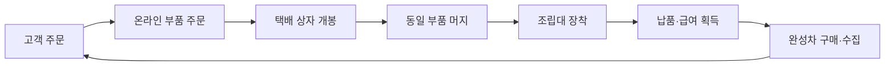

# Dream Bike Garage — 머지게임 시스템 설계서

> 한글 제목: **오늘부터 자전거 부자**  
> 문서 상태: Draft v1.0  
> 작성일: 2026-07-31  
> 대상: 기획·설계·개발 공통

## 1. 문서 목적

이 문서는 Dream Bike Garage의 초기 핵심 플레이를 정의한다. 게임은 경영 시뮬레이션이 아니라 **자전거 조립 머지와 완성차 수집을 중심으로 하는 캐주얼 게임**으로 시작한다.

초기 버전의 목표는 다음 두 가지다.

1. 손님의 주문에 맞춰 제한된 보드에서 부품을 머지하고 자전거를 조립하는 짧고 직관적인 플레이
2. 주문 보상으로 원하는 자전거를 구매해 컬렉션을 채우는 장기 목표

매장 경영, 직원 관리, 레이스 등은 핵심 루프가 검증된 이후의 확장 기능으로 분리한다.

## 2. 게임 콘셉트

> 자전거 샵에서 아르바이트하며 손님의 자전거를 조립해 판매하고, 번 돈으로 꿈꾸던 자전거를 구매해 나만의 컬렉션을 완성하는 캐주얼 머지 게임

### 2.1 자전거의 두 가지 역할

| 구분 | 획득 방법 | 게임 내 역할 |
|---|---|---|
| 주문 자전거 | 부품 주문 → 머지 → 조립 | 손님에게 납품하고 급여를 받는 단기 목표 |
| 내 자전거 | 급여를 모아 구매 | 도감과 차고에 보관하는 장기 수집 목표 |

주문 자전거와 수집 자전거를 분리해 “왜 조립하고 돈을 버는가?”를 명확하게 만든다.

## 3. 핵심 게임 루프



### 3.1 한 판의 진행

1. 고객 주문과 제한 시간을 확인한다.
2. 주문에 필요한 부품 종류와 목표 레벨을 확인한다.
3. 온라인 부품몰에서 필요한 카테고리를 선택해 주문한다.
4. 보드에 도착한 택배 상자를 열어 하위 부품을 획득한다.
5. 같은 종류·같은 레벨의 부품 두 개를 합쳐 상위 부품을 만든다.
6. 완성된 부품을 조립대에 장착한다.
7. 모든 필수 부품을 장착하면 자전거가 완성되고 보상을 받는다.
8. 모은 코인으로 개인 컬렉션용 완성차를 구매한다.

## 4. 주문 시스템

주문 화면에는 다음 정보를 표시한다.

- 주문 자전거 이미지와 이름
- 필수 부품 목록
- 부품별 요구 레벨
- 권장 완료 시간
- 기본 급여
- 시간 보너스와 품질 보너스

### 4.1 MVP 주문 예시

| 항목 | 요구 사항 |
|---|---|
| 주문명 | 어반 로드 자전거 |
| 프레임 | Lv.3 |
| 휠셋 | Lv.2 |
| 구동계 | Lv.2 |
| 핸들바 | Lv.1 |
| 권장 시간 | 3분 |
| 기본 급여 | 1,500 코인 |

### 4.2 주문 유형

| 유형 | 특징 | 적용 시점 |
|---|---|---|
| 일반 주문 | 표준 시간과 표준 보상 | MVP |
| 긴급 주문 | 낮은 요구 레벨, 짧은 제한 시간 | MVP 후반 |
| 프리미엄 주문 | 높은 요구 레벨, 큰 품질 보너스 | 확장 |
| 맞춤 주문 | 색상·계열 등 추가 조건 | 확장 |
| 복수 주문 | 여러 주문 중 우선순위 선택 | 확장 |

## 5. 온라인 부품 주문

부품 생성기는 작업대가 아니라 스마트폰 또는 태블릿 형태의 **온라인 부품몰**로 표현한다.

### 5.1 기본 규칙

- 플레이어가 주문할 부품 카테고리를 직접 선택한다.
- 주문 시 코인 또는 주문 포인트를 소비한다.
- 택배 상자가 보드의 빈 칸에 도착한다.
- 상자를 열면 선택한 카테고리의 부품이 등장한다.
- 카테고리는 확정하고, 등장 레벨에는 소량의 확률 변화를 둔다.

예시:

| 선택 카테고리 | 등장 결과 |
|---|---|
| 프레임 주문 | 프레임 Lv.1 80%, 프레임 Lv.2 20% |
| 휠셋 주문 | 휠셋 Lv.1 80%, 휠셋 Lv.2 20% |

완전 무작위 생성은 시간제한 플레이에서 운에 의한 실패감을 키우므로 사용하지 않는다.

### 5.2 배송 연출

- 주문 버튼 터치
- 보드 상단에 배송 알림 표시
- 택배 상자가 빈 칸에 도착
- 상자 개봉 시 부품 아이콘과 짧은 효과 표시

배송 대기시간은 MVP에서는 즉시 또는 매우 짧게 유지한다. 이후 난이도와 성장 요소에 따라 배송 슬롯, 무료 배송, 긴급 배송 등을 확장할 수 있다.

## 6. 머지 시스템

### 6.1 기본 머지 규칙

동일한 종류와 동일한 레벨의 부품 두 개를 합쳐 다음 레벨 부품 하나를 만든다.

```text
프레임 Lv.1 + 프레임 Lv.1 → 프레임 Lv.2
프레임 Lv.2 + 프레임 Lv.2 → 프레임 Lv.3
```

- 프레임은 프레임끼리 머지한다.
- 휠셋은 휠셋끼리 머지한다.
- 구동계는 구동계끼리 머지한다.
- 핸들바는 핸들바끼리 머지한다.
- 서로 다른 부품은 합쳐지지 않는다.
- 완성차는 머지하지 않고 조립대에서 완성한다.

### 6.2 MVP 부품 구성

| 부품 | 게임 내 표현 | 단계 |
|---|---|---|
| 프레임 | 자전거 뼈대 | Lv.1~Lv.4 |
| 휠셋 | 앞·뒤 바퀴 한 세트 | Lv.1~Lv.4 |
| 구동계 | 크랭크·체인·기어 묶음 | Lv.1~Lv.4 |
| 핸들바 | 조향 부품 묶음 | Lv.1~Lv.4 |

실제 조립 단위를 모두 분리하기보다 한눈에 이해되는 네 가지 카테고리로 단순화한다.

### 6.3 보드

- 초기 검토 크기: **6×7**
- 아이템 이동: 빈 칸으로 드래그
- 머지: 같은 아이템 위로 드래그
- 보드가 가득 찼을 때 신규 주문 차단 및 안내
- 불필요한 부품은 코인을 지불해 반품하거나 낮은 가격으로 판매

보드의 재미는 단순 정리가 아니라 “지금 어떤 부품을 주문하고 무엇을 남길 것인가”라는 공간 판단에서 만든다.

### 6.4 연속 머지 콤보

짧은 시간 안에 연속으로 머지하면 플레이 흐름을 가속하는 보상을 준다.

| 조건 | 보상 예시 |
|---|---|
| 3연속 머지 | 다음 배송 시간 단축 |
| 5연속 머지 | 다음 부품 주문 무료 |
| 7연속 머지 | 주문 필수 부품 하나 확정 등장 |

정확한 제한 시간과 보상 수치는 플레이 테스트로 조정한다.

## 7. 조립 시스템

필요한 부품을 만든 뒤 보드 옆 조립대에 드래그해 장착한다.

| 장착 부품 | 화면 변화 |
|---|---|
| 프레임 | 자전거 뼈대 등장 |
| 휠셋 | 앞·뒤 바퀴 등장 |
| 구동계 | 체인·크랭크·기어 등장 |
| 핸들바 | 자전거 완성 연출 |

주문에서 요구한 레벨 이상의 부품도 장착할 수 있다.

> 요구: 휠셋 Lv.2 → 납품: 휠셋 Lv.3 → 품질 보너스 획득

이를 통해 플레이어는 다음 중 하나를 선택한다.

- 요구 레벨에서 즉시 납품해 시간 보너스를 받는다.
- 한 단계 더 머지해 품질 보너스를 노린다.

이 **시간과 품질의 선택**을 머지 플레이의 중심 게임성으로 둔다.

## 8. 제한 시간과 실패 처리

일반 주문에는 완전 실패보다 소프트 타이머를 적용한다.

| 완료 시점 | 결과 |
|---|---|
| 권장 시간 내 | 기본 급여 + 빠른 조립 보너스 |
| 권장 시간 초과 | 기본 급여 |
| 크게 초과 | 기본 급여 일부 감소 또는 만족도 감소 |

완전 실패가 있는 강한 타이머는 긴급 주문이나 이벤트 챌린지에서만 사용한다. 캐주얼 플레이의 반복 피로를 줄이고, 초보자가 주문을 끝까지 경험하게 하기 위함이다.

## 9. 보상과 컬렉션

### 9.1 주문 보상

```text
최종 보상 = 기본 급여 + 시간 보너스 + 품질 보너스 + 콤보 보너스
```

- 기본 급여: 주문 완료 보상
- 시간 보너스: 권장 시간 안에 완료
- 품질 보너스: 요구 레벨보다 높은 부품 장착
- 콤보 보너스: 연속 머지 달성

### 9.2 완성차 컬렉션

주문으로 번 코인으로 수집용 자전거를 구매한다.

- 종류: 로드, MTB, 그래블, 미니벨로
- 등급: 입문, 중급, 고급, 드림 바이크
- 변형: 색상, 프레임 형태, 휠 스타일
- 특별 모델: 빈티지, 시즌, 한정 컬러

MVP에서는 가상 브랜드와 모델을 사용한다. 실제 브랜드는 라이선스 또는 협업이 확정된 이후 추가한다.

## 10. 화면 구성 초안

### 10.1 주문 플레이 화면

- 상단: 현재 주문, 남은 시간, 예상 보상
- 중앙: 6×7 머지 보드
- 우측 또는 하단: 자전거 조립대
- 하단: 프레임·휠셋·구동계·핸들바 온라인 주문 버튼
- 보조 기능: 반품, 창고, 일시정지

### 10.2 컬렉션 화면

- 보유 자전거 목록
- 미보유 자전거 실루엣
- 자전거 종류와 등급 필터
- 선택한 자전거의 상세 정보
- 구매 또는 전시 기능

## 11. MVP 범위

### 포함

- 주문 한 번에 1건
- 부품 4종, 각 Lv.1~Lv.4
- 카테고리 선택형 온라인 주문
- 동일 부품 2-to-1 머지
- 6×7 머지 보드
- 조립대 장착과 단계별 완성 연출
- 소프트 제한 시간
- 시간·품질 보너스
- 기본 연속 머지 콤보
- 코인 보상
- 수집용 자전거 구매와 도감
- 진행 상태 저장

### 제외 또는 확장

- 매장 손익·재고 등 경영 시뮬레이션
- 직원 고용과 관리
- 레이스와 세계 코스
- 완성차끼리의 진화 머지
- 복잡한 브랜드별 진화 트리
- 매치3 미니게임
- 시즌 패스와 복잡한 과금
- 실제 브랜드 라이선스와 O2O

샵 외형이나 작업대가 개선되는 연출은 사용할 수 있지만, MVP에서는 별도 경영 시스템으로 만들지 않는다.

## 12. 밸런스 초기값

| 항목 | 초기 제안 | 검증 포인트 |
|---|---:|---|
| 보드 크기 | 6×7 | 정리 스트레스와 판단 재미 |
| 주문당 부품 종류 | 3~4개 | 한 판의 복잡도 |
| 최대 부품 레벨 | Lv.4 | 주문 완료 시간 |
| 일반 주문 권장 시간 | 2~3분 | 초보 완료율 |
| 상위 부품 등장 확률 | 20% | 운과 전략의 균형 |
| 품질 보너스 | 단계당 +10~20% | 추가 머지 선택률 |
| 콤보 판정 간격 | 2~3초 | 조작 난이도 |

수치는 확정값이 아니라 첫 플레이 테스트를 위한 출발점이다.

## 13. 플레이 테스트 확인 항목

1. 온라인 주문의 카테고리 선택이 직관적인가?
2. 보드 정리가 재미있는 판단으로 느껴지는가?
3. 필요한 부품이 나오지 않아 운 때문에 실패했다고 느끼지 않는가?
4. 조립대에 부품을 장착할 때 자전거를 만든다는 감각이 있는가?
5. 빠른 납품과 상위 부품 제작 사이에서 실제 선택이 발생하는가?
6. 소프트 타이머가 긴장감을 주면서도 스트레스가 과하지 않은가?
7. 주문 보상이 컬렉션 자전거 구매 동기로 이어지는가?
8. 한 판이 끝난 뒤 다음 주문을 바로 시작하고 싶은가?

## 14. 확정이 필요한 기획 항목

- 주문용 에너지 또는 코인 소비 방식
- 부품 반품·판매 규칙
- 주문 사이에 보드를 유지할지 초기화할지
- 조립대 장착 후 부품 회수 가능 여부
- 상위 부품 장착 보너스의 최대치
- 컬렉션 자전거 구매 가격과 해금 조건
- 일반 주문과 긴급 주문의 등장 비율
- 실제 브랜드 사용 여부와 라이선스 진행 방식

## 15. 핵심 원칙

> **부품은 머지하고, 자전거는 조립하며, 완성차는 수집한다.**

이 원칙을 기준으로 초기 기능을 판단한다. 기능이 머지·조립·수집의 반복을 강화하지 않거나 플레이를 경영 시뮬레이션으로 바꾸는 경우 확장 단계로 미룬다.
