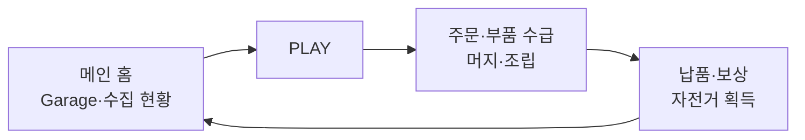

# 메인 홈 화면 구조

> 문서 상태: **협의안 (Lab 검증 전)**  
> 출처: 2026-08-06 주간 회의 화이트보드 스케치 및 2026-08-13 추가 확인  
> ([회의 기록](../meetings/2026-08-06-weekly-sync.md))  
> 실제 채택 전 Lab의 메인 홈·플레이 화면 트랙에서 비교 검증합니다.

## 1. 화면의 역할

이 화면은 머지 보드가 바로 노출되는 플레이 화면이 아니라, 게임 접속 후 가장 먼저 머무는 **Garage형 메인 홈**입니다.

- 중앙에서 대표 자전거와 수집·성장 현황을 확인합니다.
- 주변 메뉴에서 주문, 이벤트, Tour, 랭킹, Status로 이동합니다.
- 하단의 가장 강한 행동인 **PLAY**를 선택하면 별도의 주문·머지·조립 화면으로 전환됩니다.
- 플레이 결과로 얻은 자전거와 보상은 메인 홈의 Garage에 반영됩니다.

## 2. 합의 화면 배치

```text
┌────────────────────────────────┐
│ 스태미너    주문 자전거들    코인 │
├───────┬────────────────┬───────┤
│ 이벤트 │                │ Tour  │
│       │   Garage 로비   │       │
│ 랭킹  │   대표 자전거    │ 조립  │
│       │ 수집 현황·다음 목표│Status │
├───────┴────────┬───────┴───────┤
│ 직급·프로필     │  PLAY  │ 수집  │
└────────────────┴────────┴───────┘
```

| 영역 | 요소 | 역할 |
|---|---|---|
| 상단 | 스태미너, 주문 자전거 슬롯, 코인 | 플레이 가능 상태와 대기 주문을 빠르게 확인 |
| 좌측 | 이벤트, 리더 순위 | 기간성 콘텐츠와 경쟁 정보 진입 |
| 중앙 | Garage, 대표 자전거, 보유 수, 수집률, 다음 해금 | 소유감과 장기 목표를 전달하는 메인 시각 영역 |
| 우측 | Tour, 조립·성장, Status·레벨 | 장기 진행과 플레이어 성장 진입 |
| 하단 | 직급·프로필, PLAY, 수집 | PLAY를 최우선 행동으로 강조 |

## 3. 화면 전환



## 4. 최근 모바일 게임 패턴과의 정합성

- 수집 대상은 홈 중앙에서 크게 보여 소유감과 복귀 동기를 만듭니다.
- 플레이 진입은 하단 중앙의 단일 Primary CTA로 명확하게 둡니다.
- 이벤트·랭킹·Tour는 보조 진입점으로 두어 중앙 자전거와 경쟁하지 않게 합니다.
- 모든 기능을 한 화면에서 상세히 보여주지 않고 현재 상태와 알림만 요약합니다.
- 첫 접속·초기 MVP에서는 잠긴 기능을 숨기거나 단계적으로 노출합니다.

## 5. 개선 원칙

1. **주문 슬롯 단순화**: 주문 5개를 동일 강조하지 않고 현재 주문 1개와 대기 주문 요약을 우선합니다.
2. **중앙 시각 집중**: 대표 자전거가 화면의 시각적 중심이 되며 수집률·다음 목표는 짧게 표시합니다.
3. **PLAY 우선순위**: 크기·색상·위치로 화면에서 가장 먼저 눌러야 할 버튼임을 명확히 합니다.
4. **메뉴 단계적 공개**: 랭킹·이벤트·상점 등 MVP 밖 기능은 잠금 또는 후순위로 처리합니다.
5. **알림 절제**: 빨간 점·배지는 실제 보상이나 제한시간이 있을 때만 사용합니다.
6. **모바일 규격 준수**: 390×810, Safe Area, 최소 44×44px 터치 영역을 기준으로 합니다.

## 6. Lab 검증 항목

- D안: 일반적인 Garage Lobby / Collection Hub 패턴
- E안: 회의 배치 기반 Garage 홈·PLAY 분리형
- 접속 3초 안에 대표 자전거, 수집 진행, PLAY를 인지하는지 비교
- PLAY 진입 후 HOME 복귀와 보상 반영 흐름 확인
- 좌우 기능 버튼이 중앙 자전거를 방해하지 않는지 확인
- 작은 화면에서 텍스트·버튼 겹침과 Safe Area 확인

## 7. 확정이 필요한 항목

- [ ] 상단 주문 슬롯의 정확한 개수와 현재/대기 주문 표현
- [ ] 우측 조립 메뉴를 조립도, 성장 또는 작업실 중 무엇으로 정의할지
- [ ] 하단 수집 버튼과 중앙 Garage 상세 진입의 역할 구분
- [ ] 랭킹·이벤트의 MVP 포함 여부
- [ ] PLAY 진입 시 주문 선택 화면을 거칠지 즉시 현재 주문으로 들어갈지
- [ ] Garage 대표 자전거의 변경·업그레이드 동작

## 관련 문서

- [2026-08-06 회의 기록](../meetings/2026-08-06-weekly-sync.md)
- [머지게임 시스템 설계서](MERGE_GAME_SYSTEM_DESIGN.md)
- [MVP 범위](MVP.md)
- [웹·앱 화면 구조 전략](../development/SCREEN_LAYOUT_STRATEGY.md)
- [설계 이슈 #52](https://github.com/aigemro/dream-bike-garage/issues/52)
- [Lab 트랙 #87](https://github.com/aigemro/dream-bike-garage-lab/issues/87)
