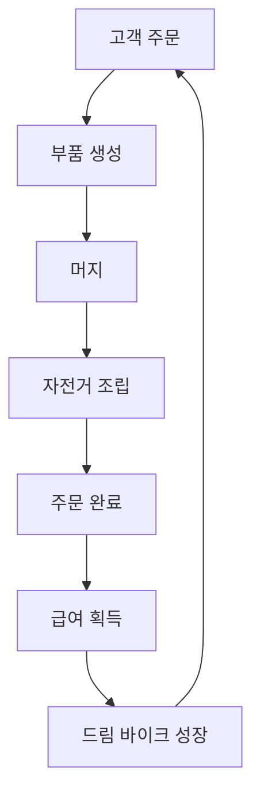

# Game Concept

## 1. 프로젝트 정체성

| 구분 | 제목 |
|---|---|
| 영문 제목 | **Dream Bike Garage** |
| 한글 제목 | **오늘부터 자전거 부자** |
| 장르 | 캐주얼 머지 · 주문 제작 · 수집 |
| 핵심 문장 | **드림 바이크를 갖기 위해 자전거샵에서 일하는 이야기** |

기존 **Peloton Merge: Grand Tour World** 콘셉트는 Deprecated로 분류합니다. 이후의 기획, 개발, 화면 구성과 콘텐츠 판단은 이 문서를 기준으로 합니다.

## 2. 게임 한 줄 소개

자전거샵 아르바이트생이 고객 주문에 맞춰 부품을 머지하고 자전거를 조립해 급여를 번 뒤, 그 돈으로 자신의 드림 바이크를 성장시키는 캐주얼 머지 게임입니다.

## 3. 배경과 플레이어의 목표

플레이어는 자전거를 좋아하지만 꿈꾸던 자전거를 구매할 돈이 없습니다. 드림 바이크를 갖기 위해 동네 자전거샵에서 아르바이트를 시작합니다.

샵에는 다양한 고객의 주문이 들어옵니다. 플레이어는 온라인으로 부품을 주문하듯 부품을 생성하고, 같은 부품을 머지해 더 높은 단계의 필요한 부품을 만듭니다. 준비된 부품으로 고객의 자전거를 조립해 전달하면 급여를 받습니다.

일해서 번 돈은 단순한 점수가 아닙니다. 플레이어가 갖고 싶었던 드림 바이크를 사고, 조립하고, 더 좋은 모습으로 성장시키는 장기 목표와 직접 연결됩니다.

## 4. 핵심 판타지

이 게임이 전달해야 하는 감정은 다음과 같습니다.

- 자전거샵에서 일하며 조립 실력이 늘어나는 성취감
- 흩어진 부품이 완성된 자전거가 되는 제작의 만족감
- 다양한 자전거와 브랜드를 발견하고 모으는 수집의 즐거움
- 아르바이트 급여를 모아 내 드림 바이크에 가까워지는 기대감

경영 시뮬레이션과 레이스는 핵심이 아닙니다. 기본 경험은 **머지, 주문 완성, 수집, 드림 바이크 성장**에 집중하며 다른 시스템은 향후 확장 요소로 다룹니다.

## 5. 핵심 게임 루프

1. 고객이 원하는 자전거 주문과 필요한 부품 목록을 확인합니다.
2. 재화를 사용해 기본 부품을 생성합니다.
3. 같은 종류와 단계의 부품을 머지해 주문에 필요한 부품을 만듭니다.
4. 요구 부품을 모두 모으면 자전거를 조립합니다.
5. 완성된 자전거를 고객에게 전달해 주문을 완료합니다.
6. 주문 난이도와 완성도에 맞는 급여를 받습니다.
7. 급여를 사용해 자신의 드림 바이크를 획득하거나 성장시킵니다.
8. 새로운 주문에 도전하며 더 다양한 부품과 자전거를 해금합니다.

## 6. 핵심 시스템

### 6.1 머지

- 동일한 종류와 단계의 부품 두 개를 합쳐 상위 단계 부품 하나를 만듭니다.
- 상위 단계는 현실의 제조 공정보다 게임적인 성장 규칙을 우선합니다.
- 주문 목표가 플레이어에게 “무엇을 머지해야 하는지”를 명확히 제시합니다.

### 6.2 주문 제작

- 주문에는 목표 자전거, 필요한 부품, 보상 등의 정보가 표시됩니다.
- 플레이어는 보드 공간과 보유 재화를 고려해 필요한 부품부터 생산합니다.
- 향후 시간 제한이나 선택 주문을 추가할 수 있지만, MVP에서는 핵심 흐름을 우선 검증합니다.

### 6.3 자전거 조립

- 주문에 필요한 부품이 준비되면 하나의 완성 자전거로 조립합니다.
- 조립은 머지의 결과를 눈에 보이는 완성품으로 바꾸는 보상 단계입니다.
- 완성된 자전거를 전달해야 주문과 급여 획득이 완료됩니다.

### 6.4 브랜드 컬렉션

- 주문과 진행을 통해 다양한 자전거 및 브랜드 컬렉션을 채웁니다.
- 컬렉션은 발견 기록과 수집 목표를 제공하되, 브랜드 사용은 라이선스 정책을 별도로 검토합니다.

### 6.5 드림 바이크 성장

- 플레이어가 일하는 이유를 보여주는 장기 성장 시스템입니다.
- 주문으로 받은 급여를 사용해 드림 바이크를 획득하고 부품 또는 단계를 성장시킵니다.
- 고객 자전거는 단기 목표, 드림 바이크는 장기 목표 역할을 합니다.

## 7. MVP 범위

### 포함

- 기본 부품 생성과 2-to-1 머지
- 고객 주문 및 요구 부품 표시
- 요구 부품을 이용한 자전거 조립
- 주문 완료와 급여 보상
- 자전거/브랜드 컬렉션
- 급여를 이용한 드림 바이크 성장
- 진행 상태 저장

### 제외

- 레이스 시스템
- 본격적인 자전거샵 경영 시뮬레이션
- 복잡한 직원, 재고, 매장 확장 관리
- 광고 및 결제 시스템
- 대규모 라이브 이벤트

## 8. MVP 성공 기준

플레이어가 별도 설명 없이 다음 흐름을 이해하고 반복할 수 있어야 합니다.

> 주문을 확인한다 → 필요한 부품을 머지한다 → 자전거를 조립해 납품한다 → 급여로 내 드림 바이크를 성장시킨다

또한 고객 주문을 끝내는 단기 만족과 드림 바이크를 완성해 가는 장기 동기가 자연스럽게 연결되어야 합니다.

## 9. 향후 확장 원칙

새 기능은 다음 질문에 부합할 때 확장합니다.

1. 머지와 주문 제작의 재미를 강화하는가?
2. 자전거를 수집하고 드림 바이크를 성장시키는 동기를 높이는가?
3. 캐주얼 게임의 접근성을 해치지 않는가?

레이스와 경영 요소는 위 원칙을 충족하고 MVP 핵심 루프가 검증된 이후 별도 확장으로 검토합니다.
